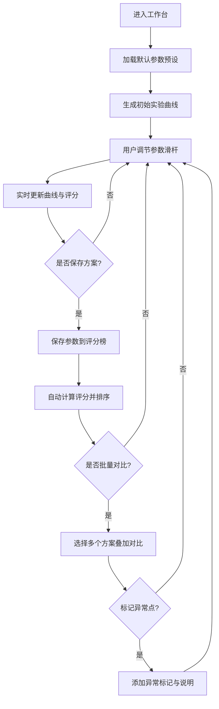

## 1. 产品概述

实验曲线调参台是一个面向科研人员和工程师的交互式参数调节与实验模拟可视化工具。用户可以通过滑杆实时调节温度、压力、配比等实验参数，系统即时生成模拟实验曲线并给出评分，帮助快速探索最优实验方案。

- 核心目标：降低实验试错成本，通过可视化调参快速定位最佳参数组合
- 目标用户：化学/材料/生物领域科研人员、工艺工程师、数据分析师

## 2. 核心功能

### 2.1 用户角色

| 角色 | 注册方式 | 核心权限 |
|------|----------|----------|
| 科研用户 | 无需注册，本地使用 | 参数调节、曲线查看、方案管理、对比分析 |

### 2.2 功能模块

1. **参数控制面板**：温度、压力、反应时间、原料配比 A/B/C 等多个滑杆参数
2. **实时曲线展示**：基于当前参数组合生成多维度实验曲线（转化率-时间、产率-温度等）
3. **评分排行榜**：根据综合评分对所有已保存方案进行排序展示
4. **参数预设管理**：内置多组常用实验参数预设，支持一键加载
5. **批量对比视图**：同时展示多条实验曲线进行可视化对比
6. **异常点标记系统**：自动或手动标记曲线上的异常数据点
7. **最佳方案排序**：按评分、产率、稳定性等多维度对方案进行排名

### 2.3 页面详情

| 页面名称 | 模块名称 | 功能描述 |
|----------|----------|----------|
| 主工作台 | 参数控制面板 | 多维度滑杆调节、数值实时显示、参数锁定功能 |
| 主工作台 | 实验曲线图表 | SVG/Canvas 实时曲线渲染、坐标轴缩放、悬浮提示 |
| 主工作台 | 评分榜面板 | 当前方案评分、历史方案排行榜、排序切换 |
| 主工作台 | 预设管理栏 | 预设方案列表、一键加载、保存自定义预设 |
| 主工作台 | 批量对比区 | 曲线叠加对比、方案选择、颜色区分 |
| 主工作台 | 异常标记区 | 自动异常检测、手动标记、异常说明 |

## 3. 核心流程

用户进入工作台后，系统加载默认参数预设并生成初始曲线。用户通过滑杆调节各项参数，曲线实时更新。用户可将满意的参数方案保存到评分榜，系统自动计算综合评分并排序。支持同时选择多个方案进行曲线对比，可标记异常数据点供进一步分析。

## 4. 用户界面设计

### 4.1 设计风格

- **设计方向**：科技感仪表盘风格（Scientific Dashboard），深色主题配合荧光色数据高亮，营造专业实验室氛围
- **主色调**：深邃深蓝灰 `#0a0e1a` 作为背景，搭配 `#1a1f2e` 面板色
- **强调色**：青色 `#00e5ff`（曲线/高亮）、琥珀色 `#ffb300`（警告/异常）、翠绿 `#00ff88`（最佳/通过）
- **中性色**： slate 色系层级灰，用于文字与边框
- **按钮风格**：微立体胶囊按钮，带辉光 hover 效果
- **字体**：使用 JetBrains Mono 等宽字体用于数据显示，Space Grotesk 用于标题
- **布局风格**：三栏式仪表盘布局，左侧参数控制、中间主图表、右侧评分榜
- **图标风格**：Lucide 线性图标，统一描边宽度

### 4.2 页面设计概览

| 页面名称 | 模块名称 | UI 元素 |
|----------|----------|----------|
| 主工作台 | 参数控制面板 | 垂直滑杆组、数值输入框、锁定开关、预设下拉菜单 |
| 主工作台 | 实验曲线图表 | 网格背景、多色折线、数据点标记、悬浮 tooltip、坐标轴标签 |
| 主工作台 | 评分榜面板 | 排名徽章、进度条评分、参数摘要、删除按钮 |
| 主工作台 | 批量对比区 | 方案选择卡片、曲线叠加切换、图例说明 |
| 主工作台 | 异常标记区 | 异常点闪烁标记、点击弹窗、备注输入 |

### 4.3 响应式

- 桌面端（默认）：三栏布局，左 280px / 中自适应 / 右 320px
- 平板端：左右面板可折叠，图表居中最大化
- 移动端：上下堆叠布局，参数面板在前，图表居中，评分榜在后

### 4.4 动效设计

- 滑杆调节时曲线平滑过渡动画（CSS transition）
- 保存方案时评分榜项目滑入动画
- 异常点脉冲闪烁效果
- 页面加载时各模块渐次显现
