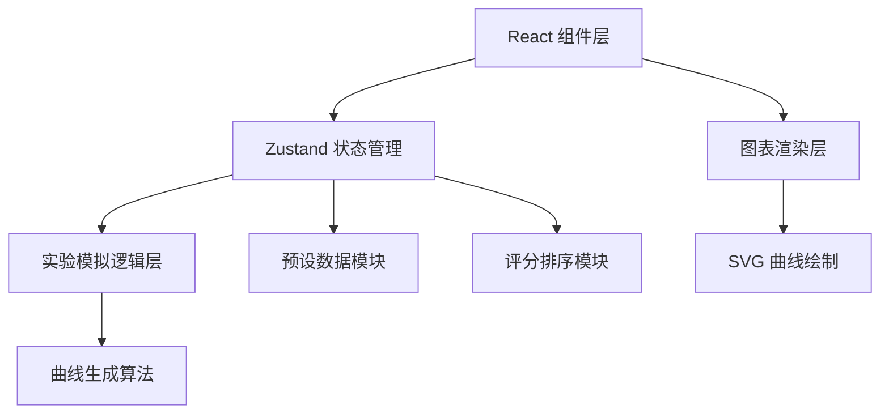
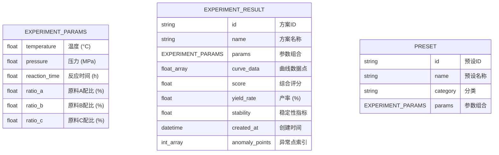

## 1. 架构设计



## 2. 技术说明

- **前端**：React@18 + TypeScript + Vite + TailwindCSS@3
- **初始化工具**：vite-init
- **状态管理**：Zustand
- **图表方案**：原生 SVG 自定义绘制（轻量、可控动画）
- **图标库**：lucide-react
- **后端**：无（纯前端应用，所有计算在浏览器端完成）
- **数据库**：无（使用 localStorage 持久化用户方案）

## 3. 路由定义

| 路由 | 用途 |
|------|------|
| / | 主工作台（所有功能集中在单页） |

## 4. 数据模型

### 4.1 数据模型定义



### 4.2 TypeScript 类型定义

```typescript
interface ExperimentParams {
  temperature: number;
  pressure: number;
  reactionTime: number;
  ratioA: number;
  ratioB: number;
  ratioC: number;
}

interface CurvePoint {
  x: number;
  y: number;
  isAnomaly?: boolean;
}

interface ExperimentResult {
  id: string;
  name: string;
  params: ExperimentParams;
  curveData: CurvePoint[];
  score: number;
  yieldRate: number;
  stability: number;
  createdAt: number;
  anomalyPoints: number[];
}

interface Preset {
  id: string;
  name: string;
  category: string;
  params: ExperimentParams;
}
```

## 5. 项目目录结构

```
src/
├── components/
│   ├── ControlPanel/       # 参数控制面板组件
│   │   ├── ParameterSlider.tsx
│   │   └── PresetSelector.tsx
│   ├── Chart/              # 图表组件
│   │   ├── ExperimentChart.tsx
│   │   ├── CurveLine.tsx
│   │   └── AnomalyMarker.tsx
│   ├── Ranking/            # 评分榜组件
│   │   ├── RankingList.tsx
│   │   └── RankingItem.tsx
│   ├── Comparison/         # 批量对比组件
│   │   └── ComparisonPanel.tsx
│   └── common/             # 通用组件
│       ├── Button.tsx
│       └── Badge.tsx
├── store/
│   └── useExperimentStore.ts  # Zustand 状态管理
├── utils/
│   ├── curveGenerator.ts   # 曲线生成算法
│   ├── scoring.ts          # 评分算法
│   └── anomalyDetector.ts  # 异常检测算法
├── data/
│   └── presets.ts          # 内置预设数据
├── types/
│   └── index.ts            # 类型定义
├── App.tsx
├── main.tsx
└── index.css
```
